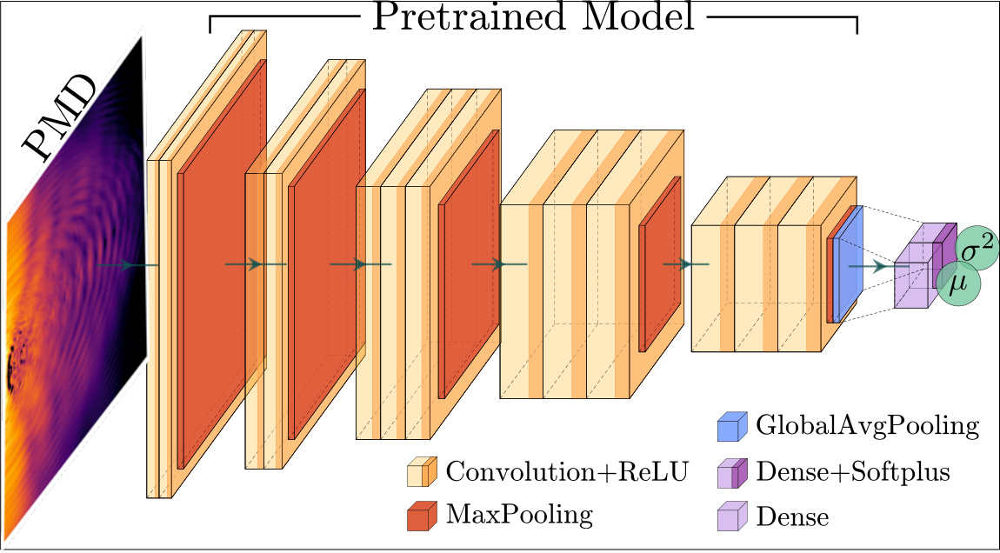

# AttoDNN - Femtosecond pulse parameter estimation from photoelectron momenta using machine learning
## Code for *[arXiv:2303.13940](https://arxiv.org/abs/2303.13940)*

<p align="center">
  
</p>

This software uses Keras for training, evaluation and explanation of the pretrained convolutional neural networks 
in supervised image regression setting. Models can be arranged into an ensemble. Examples of pretrained models used 
in this work include VGG16, Xception, EfficientNetB7, EfficientNetV2L.

Each model predicts both the value of the pulse parameter of interest, and the uncertainty (mean-variance estimator).

###This software is accompanied by datasets with photoelectron momentum distributions from QProp, Strong Field Approximation and Experiments and are available in our *[OpenData catalog](https://chaos.if.uj.edu.pl/ZOA/index.php?which=opendata&dataset=/2303.13940)*.

### Notebooks:
- *[Dataset and explanations readout](https://github.com/tszoldra/attoDNN/blob/master/notebooks/01_dataset_readout.ipynb)* [](https://githubtocolab.com/tszoldra/attoDNN/blob/master/notebooks/01_dataset_readout.ipynb)
- *[Simple training](https://github.com/tszoldra/attoDNN/blob/master/notebooks/02_training.ipynb)* [](https://githubtocolab.com/tszoldra/attoDNN/blob/master/notebooks/02_training.ipynb)
- *[Performance analysis for all models shown in the paper](https://github.com/tszoldra/attoDNN/blob/master/notebooks/03_evaluation_all_models.ipynb)* [](https://githubtocolab.com/tszoldra/attoDNN/blob/master/notebooks/03_evaluation_all_models.ipynb)
- *[Focal averaging example](https://github.com/tszoldra/attoDNN/blob/master/notebooks/04_focal_averaging.ipynb)* [](https://githubtocolab.com/tszoldra/attoDNN/blob/master/notebooks/04_focal_averaging.ipynb)

### If you use this repository or the datasets please cite the following paper:
[T. Szołdra, M. F. Ciappina, N. Werby, P. H. Bucksbaum, M. Lewenstein, J. Zakrzewski, A. S. Maxwell, Femtosecond pulse parameter estimation from photoelectron momenta using machine learning, arXiv:2302.13940 (2023)](https://arxiv.org/abs/2303.13940)
  ```
@misc{szoldra2023femtosecond,
      title={Femtosecond pulse parameter estimation from photoelectron momenta using machine learning}, 
      author={Tomasz Szołdra and Marcelo F. Ciappina and Nicholas Werby and Philip H. Bucksbaum and Maciej Lewenstein and Jakub Zakrzewski and Andrew S. Maxwell},
      year={2023},
      eprint={2303.13940},
      archivePrefix={arXiv},
      primaryClass={physics.atom-ph}
}
  ```

### Installation
1. We recommend you create a new anaconda3 environment to work with `attoDNN`:

        conda create --name attoDNN
        conda activate attoDNN
        conda install pip 
        pip install --upgrade pip

2. Install tensorflow
   
        conda install -c conda-forge cudatoolkit=11.8.0
        python3 -m pip install nvidia-cudnn-cu11==8.6.0.163 tensorflow==2.12.*
        mkdir -p $CONDA_PREFIX/etc/conda/activate.d
        echo 'CUDNN_PATH=$(dirname $(python -c "import nvidia.cudnn;print(nvidia.cudnn.__file__)"))' >> $CONDA_PREFIX/etc/conda/activate.d/env_vars.sh
        echo 'export LD_LIBRARY_PATH=$LD_LIBRARY_PATH:$CONDA_PREFIX/lib/:$CUDNN_PATH/lib' >> $CONDA_PREFIX/etc/conda/activate.d/env_vars.sh
        source $CONDA_PREFIX/etc/conda/activate.d/env_vars.sh

3. Check if tensorflow works fine:

        python3 -c "import tensorflow as tf; print(tf.config.list_physical_devices('GPU'))"

4. Install attoDNN:

        git clone https://github.com/tszoldra/attoDNN
        pip install -e attoDNN